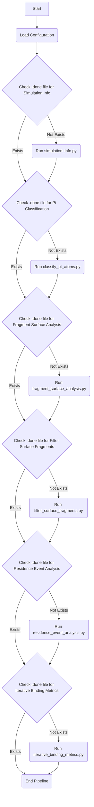

# Iterative Binding Metrics Pipeline

This document describes the `pipeline_iterative_binding.py` script, which is a modified version of the main analysis pipeline (`pipeline.py`) designed to run the binding metrics analysis iteratively over increasing time windows. This allows for observing how binding metrics evolve as more simulation data is included.

## Purpose

The primary goal of `pipeline_iterative_binding.py` is to provide a mechanism for analyzing the convergence of binding metrics. By running the binding metrics calculation on progressively longer segments of the simulation trajectory, we can assess the stability and reliability of the calculated metrics.

## Pipeline Structure

The `pipeline_iterative_binding.py` script follows the same general structure as `pipeline.py`, executing a series of analysis steps sequentially. The key difference lies in the final step:

- **Original Pipeline (`pipeline.py`)**: Ends with the standard `binding_metrics.py` script, which calculates metrics for the entire specified analysis range.
- **Iterative Pipeline (`pipeline_iterative_binding.py`)**: Replaces the standard binding metrics step with `iterative_binding_metrics.py`.

The steps in `pipeline_iterative_binding.py` are:

1.  **Simulation Info**: Gathers basic simulation metadata.
2.  **Pt Classification**: Classifies platinum atoms based on coordination number.
3.  **Fragment Surface Analysis**: Identifies fragments within a cutoff distance of the surface.
4.  **Filter Surface Fragments**: Filters the surface analysis results based on a distance cutoff.
5.  **Residence Event Analysis**: Quantifies residence events of fragments on the surface.
6.  **Iterative Binding Metrics**: Runs `binding_metrics.py` iteratively on increasing time windows and collects facet-specific metrics.

## Configuration

The `pipeline_iterative_binding.py` script uses the `config_pipeline_iterative.py` file for its configuration. A new section, `iterative_binding_metrics`, has been added to the `ANALYSIS_PARAMETERS` dictionary in this configuration file to control the behavior of the iterative binding metrics step:

```python
"iterative_binding_metrics": {
    # Number of frames to increment the analysis window by in each iteration.
    "frame_step": 100, # Example value, adjust as needed
    # Enable verbose output for the iterative script (True/False)
    "verbose": True,
}
```

-   `frame_step`: Specifies the increment in frames for each iteration of the binding metrics calculation. A smaller value results in more iterations and a finer-grained view of convergence, but increases computation time.
-   `verbose`: If set to `True`, the `iterative_binding_metrics.py` script will print detailed output during its execution.

Additionally, a new output path `iterative_binding_metrics_csv` has been added to the `AnalysisConfig` class to specify the location of the output CSV file generated by `iterative_binding_metrics.py`.

## Iterative Binding Metrics Script (`iterative_binding_metrics.py`)

The `iterative_binding_metrics.py` script is responsible for running the standard `binding_metrics.py` script multiple times. In each iteration, it increases the end frame of the analysis window, effectively including more simulation data. It collects the facet-specific binding metrics (`tau_facet_ns`, `K_D_facet`, `DeltaG_kJ_per_mol`) from each run and appends them to a single output CSV file.

The script determines the total number of frames from the `simulation_info.json` file and calculates the minimum number of frames required to meet the `min_res_time` specified in the residence event analysis configuration. The iterative process starts from this minimum frame count.

The output of this script is a CSV file (specified by `config.iterative_binding_metrics_csv`) containing the binding metrics for each facet at each analyzed end frame. This data can then be used to plot the binding metrics as a function of simulation time to assess convergence.

## Pipeline Flow (Mermaid Diagram)



This diagram illustrates the sequential nature of the pipeline and the checkpointing mechanism at each step. The final step, "Run iterative_binding_metrics.py", represents the execution of the iterative analysis.